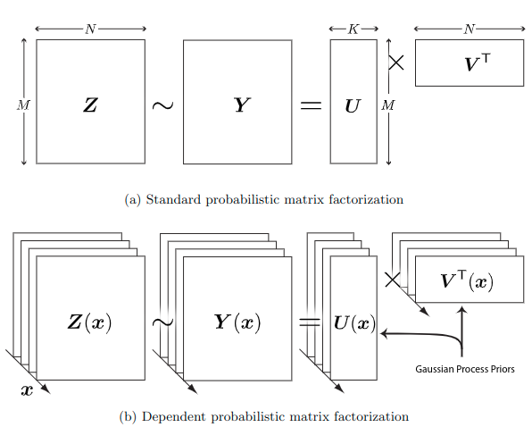

# __*Google Summer of Code 2020 Proposal*__
***
## **Topic: Gaussian Process**

## **Student: Ritesh Kumar**

***

## _About Me_

**Name:** Ritesh Kumar

**University:** [Indian Institute of Technology Kanpur](http://www.iitk.ac.in/)

**Program:** BTech Computer Science and Engineering & BTech Electrical Engineering

### _Contact Information_

**Github:** [ritesh99rakesh](https://github.com/ritesh99rakesh)

**E-mail:** ritesh99rakesh@gmail.com, riteshk@cse.iitk.ac.in

**Phone Number:** (+91) 7318015400

**Timezone:** Indian Standard Time(UTC +05:30)

### *Programming Setup*

**OS:** Ubuntu 18.04

**Editor:** Atom

**Version Control:** Git

***

### _Personal Background_

* Academic Experience

    I am a fourth-year undergraduate student at the Indian Institute of Technology Kanpur. I am pursuing BTech in Electrical Engineering with the second major in Computer Science and Engineering. My current CPI is 9.7/10 after five semesters. Few of my courses relevant for the project:
    * Probabilistic Machine Learning and Inference
    * Natural Language Processing
    * Introduction to Machine Learning
    * Probability and Statistics
    * Randomized Algorithms
    * Algorithms - I and II
    * Linear Algebra

* Programming Experience

    I am proficient in C, C++, Python, Julia, Javascript. My field of interest includes Probabilistic Machine Learning Randomized Algorithms and Robotics.

    Some of my projects:
  
    * *[GSoC 2019](https://gist.github.com/ritesh99rakesh/3bcf890df9eecc5d626531a243b245f2) ([SymPy Organization](https://github.com/sympy/sympy)):* Implemented symbolic univariate, multivariate distributions and Random Walk in stats module. Implemented compound probability space and compound distribution enabling creation of compound random variables(RV). Implemented algorithms to simplify from compound to univariate RV. Build functions to export expressions of RV to libraries like PyMC3, PyStan, SciPy and NumPy.
    * *[Deep Generative Model based Anomaly Detection in Streaming Data](https://github.com/bhatiasiddharth/MIDAS) ([Prof. Bryan Hooi](https://www.comp.nus.edu.sg/cs/bio/bhooi/)):* Studied deep generative model based anomaly detection algorithms and implemented them in PyTorch. Proposed Auto-encoder based model for anomaly detection in streaming environment. Implemented the model in PyTorch and started with writing the paper. Curretly testing the model on different datasets with anomalies in streaming environment.
    * *[Undergraduate Project](https://github.com/ritesh99rakesh/UGP) ([Prof. Vipul Arora](http://home.iitk.ac.in/~vipular/)) (Used Matlab and Python):* I am currently doing an undergraduate project, Prof. Vipul Arora. The goal of the project is to use Bayesian Optimisation and Reinforcement Learning to do Optimal Learning. Under this project, I studied and implemented Gaussian Process and Bayesian Optimisation algorithms.

***
## *The Project*

## *Introduction*

My target of GSoC'20 under Turing would be to:
* integrate `Turing.jl` and `Stheno.jl`
* write a collection of example models and notebooks in Turing's model zoo and tutorial for following topics:
  * Introduction to GP and `Stheno.jl`
  * GP for Regression
  * Non-Gaussian likelihood (GP for Classification)
  * Sparse GP Approximation
  * Bayesian Optimization
  * Elliptical Slice Sampling for inference and GP
  * When Gaussian Process Meets Big Data: A Review of Scalable GPs (Stretch Goal)

  demonstrating the usefulness and broad applicability of Gaussian Processes and ease with which they can be implemented using `Stheno.jl` and `Turing.jl`

---

## *Motivation*

I have a keen interest in Machine Learning, especially Probabilistic ML and implementing papers related to it. When doing a course on Probabilistic ML, I came across Gaussian Processes. I was fascinated by the idea that a stochastic process could be used as a prior probability distribution over functions in Bayesian inference leading to various applications. Also being from Electrical background, I found extensive use for GP in signal processing and Brownian motion. I have implemented GP in python using `sklearn.gaussian_process` and `GPy`. They worked perfectly, but one setback that I found with these libraries is that they are not so intuitive (or natural) to use. Then I came across `Julia/Turing` and was amazed at the ease one can describe Probabilistic models and so is the case with `Stheno.jl` but it did not have many examples, and some more work has to be done to use `Stheno.jl` Seamlessly with `Turing.jl`. And hence I take up this project so that more enthusiasts like me can appreciate the power of GP and ease with which they can be implemented in `Julia`.

***

## _Implementation plans_
**STAGE 1**

*Integration of `Turing.jl` and `Stheno.jl`*

I am currently working on implementing a plotting submodule for `Stheno.jl` ([PR](https://github.com/willtebbutt/Stheno.jl/pull/26)) and will complete this as soon as end semester exams get over (I will finish this irrespective of my selection).

After discussion with Will Tebbutt, I have the following observations for integration of `Turing.jl` and `Stheno.jl`:
* There are two possible forms of integration here:
  - “Basic Integration” - the two packages are already _kind of_ integrated, in the sense that you can use Stheno to construct a distribution object that is compatible with Turing. The interface is a bit clunky though, and the resulting code won’t be ideal.
  - “Complete Integration” - this will involve making the Turing compiler (i.e. `@model` macro) aware of Stheno to harmonise the interfaces a bit.
* Will Tebbutt recommend implementing models using the interface that’s already available as the first step, just so that we have some examples of working with, and then we can spend some time implementing the slight extensions to the Turing compiler to make the interface a bit neater.

So, I plan first to write two simple, yet comprehensive models: Introduction to `Stheno.jl` and GP, and GP for Regression (described below) and then work on Turing compiler to integrate Stheno, complete the integration while testing on already implemented models.

For the above models, I will take reference from `GPy` tutorials:
* [GP Regression](https://nbviewer.jupyter.org/github/SheffieldML/notebook/blob/master/GPy/basic_gp.ipynb)
* [GP Classification](https://nbviewer.jupyter.org/github/SheffieldML/notebook/blob/master/GPy/basic_classification.ipynb)
* [Heteroscedastic Regression](https://nbviewer.jupyter.org/github/SheffieldML/notebook/blob/master/GPy/heteroscedastic_regression.ipynb)
* [HMC for GP Models](https://nbviewer.jupyter.org/github/SheffieldML/notebook/blob/master/GPy/sampling_hmc.ipynb)

These tutorials are easy to implement. I will use `Turing.jl` for inference.

---

**STAGE 2**

*Notebook on Introduction to GP & Stheno.jl*

Sources:
* [Gaussian Process in Machine Learning](https://link.springer.com/content/pdf/10.1007%2Fb100712.pdf "GP in ML")
* [Gaussian Processess](http://www.cs.cmu.edu/~./16831-f12/notes/F11/16831_lecture19_ykrishna.pdf "Gaussian Processess")

I will write notebooks to introduce the learner to `Stheno.jl`  and how to use it to implement GP in Julia using a couple of toy examples to stress upon the concept of the tradeoff between penalty and data-fit in the GP model is automatic, making it a non-parametric model and simplifies training.

Topics covered:
* Gaussian Processes
* Posterior GP in a noiseless and noisy environment
* Training of GP

---

*GP for Regression*

Source:
* [Gaussian Processes for Regression](http://papers.nips.cc/paper/1048-gaussian-processes-for-regression.pdf)

I would implement this paper using *The Robot Arm Problem* described in the paper. For hyperparameter tuning two methods are proposed:
* Maximum Likelihood Estimation
* Hamiltonian Monte Carlo (HMC)

I will write a notebook using both the methods to compare them. This notebook will also serve as an excellent example for HMC sampling for inference method as suggested by Will.

I will also write a Support Vector Regression model using [`SVR.jl`](https://github.com/madsjulia/SVR.jl). We can then compare GP against SVR to see the applicability of GP in *small data regression*.

---

*GP for Classification and Non-Gaussian Likelihood*

Source:
* [Bayesian Classification with Gaussian Processes](https://ieeexplore.ieee.org/stamp/stamp.jsp?tp=&arnumber=735807)
* [Model-based geostatics](https://pdfs.semanticscholar.org/54d5/7429b0fc960fda52dd02b31972697b1d7bc0.pdf)

In the first paper, the authors consider the problem of assigning an input vector to one of `m` classes by predicting `P(class=c|data=x)`. A Gaussian process prior is placed on `y(x)`, and is combined with the training data to obtain predictions for new `x` points. Bayesian treatment is provided by integrating over uncertainty in `y` and in the parameters that control the Gaussian process prior; the necessary integration over `y` is carried out using *Laplace’s approximation*. The method is generalized to multiclass problems `(m > 2)` using the softmax function. In training, the authors have used HMC and

I will write a notebook implementing the above method and using the standard datasets:
* Binary classification: *Leptograpsus crabs and Pima Indian diabetes datasets*
* Multiclass classification: *Forensic Glass*

*Note:* The paper also compares HMC and standard Metropolis MCMC algorithm for their convergence time. This part can also be incorporated, but it will not be my priority.

The second paper tries to model Poisson distribution generated data using GP. This is also a classification problem but with non-gaussian likelihood. This problem is one of the topics listed under [`Stheno.jl`](https://github.com/willtebbutt/Stheno.jl/issues).

To make this notebook complete, I will contrast the above results with SVM or Decision Tree classification. This notebook will also help the learner to see the integration of `Stheno.jl` and `Turing.jl`.

---

**STAGE 3**

*Sparse GP Approximation*

Sources:
* [A Unifying View of Sparse
Approximate Gaussian Process Regression](http://www.jmlr.org/papers/volume6/quinonero-candela05a/quinonero-candela05a.pdf)
* [A Unifying Framework for Gaussian Process Pseudo-Point
Approximations](http://www.jmlr.org/papers/volume18/16-603/16-603.pdf)

All previous algorithms have time-complexity of O(N^3), where N is the number of data points. By using sparse GP algorithm, we can get time-complexity of O(N * M^2) where M<<N and M is pseudo-input size. The above algorithm is implemented in `Stheno.jl` by Will and I will use it to write a notebook to demonstrate the same.

Under this algorithm, an additional set of `m` latent variables **u**, called the *inducing variables*. These input variables are values of the GP corresponding to a set of input locations **Xu** which we call *inducing inputs*. Whereas the additional latent variables **u** are always marginalized out in the predictive distribution, the choice of inducing inputs *does* leave an imprint on the final solution, making the GP sparse and reduce the computation time.

---

**STAGE 4**

*Bayesian Optimization*

Source:
* [Practical Bayesian Optimization of Machine Learning Algorithms](http://papers.nips.cc/paper/4522-practical-bayesian-optimization-of-machine-learning-algorithms.pdf)

Bayesian Optimization(BO) is a direct application of GP. The paper shows that using BO for hyperparameter tuning for the ML algorithm dramatically improves the algorithm. The paper mentions Monte Carlo Acquisition for Parallelizing BO, and I plan to implement it.

I wish to implement this paper with the above method for Latent Dirichlet Allocation algorithm.

The implementation would be a great addition to tutorial under Turing's model zoo as this would introduce the learner to BO and its technical details and the standard algorithm of LDA.

---

**STAGE 5**

*Elliptical Slice Sampling for inference and GP*

Source:

* [Incorporating side information in Probabilistic Matrix Factorization with Gaussian Processes](https://arxiv.org/pdf/1003.4944.pdf)

As suggested by Will, I propose the above paper which uses concepts from GP and Elliptical Slice Sampling for inference.

Probabilistic matrix factorization (PMF) is a powerful method for modelling data associated with pairwise relationships. In many domains, there is additional information that can assist in prediction. For example, when modelling movie ratings, we might know when the rating occurred, where the user lives, or what actors appear in the movie.

It is difficult, to incorporate this side information into the PMF model. The authors propose a framework for incorporating side information by coupling together multiple PMF problems via Gaussian process priors. They have to use Elliptical Slice Sampling algorithm for sampling from the posterior distribution
over latent functions with Gaussian process priors.

---

**STAGE 6 (Stretch Goals)**

*When Gaussian Process Meets Big Data: A Review of Scalable GPs*

Source:
* [When Gaussian Process Meets Big Data: A Review of Scalable GPs](https://arxiv.org/pdf/1807.01065.pdf)

This topic is one of the listed issues under [`Stheno.jl`](https://github.com/willtebbutt/Stheno.jl/issues). This paper is an extension of Sparse Approximate GP that I implement in stage 3.

This paper devotes to reviewing state-of-the-art scalable GPs involving two main categories: *global approximations* which distillate the entire data and *local approximations* which divide the data for subspace learning. Particularly, for global approximations, the focus is on sparse approximations comprising prior approximations which modify the prior but perform exact inference, and posterior approximations which retain exact prior but perform approximate inference; for local approximations, they highlight the mixture/product of experts that conducts model averaging from multiple local experts to boost predictions.

I have gone through the paper and found it to be quite interesting. I will discuss more this paper with the mentors near the end of GSoC'20. One of the algorithms mentioned in the paper is already covered in stage 3, and other proposed can be added quickly as I would be quite experienced by now to write GP models in `Turing` using `Stheno`

***

## _Timeline_

**Community Bonding Period**

Goals for this period are:

* I will complete the plotting module in `Stheno.jl` and will write a short tutorial based on it.
* I will write the basic models mentioned in Stage 1.
* Discuss with mentors regarding exact addition to Turing compiler for harmonizing Stheno with it.
* I will also read the papers to get the precise implementation for each algorithm.

**Coding Period**

June 1 - June 14 (Week 1 and 2)

* I will start with integration part and will use the above models for testing the integration.
* I will work on `@model` macro for seamless Stheno interface in Turing.
* I also plan to write documentation and tests for this part since its working is vital for the rest of the project.
* Completion of Stage 1.

June 15 - June 21 (Week 3)

* I shall write the notebook on introduction to GP and Stheno.jl.
* I will also write a notebook on GP for Regression.
* Since GP for Regression and Classification are very similar, I will even start writing the notebook for GP for Classification using an approach similar to GP for Regression.

June 22 - June 28 (Week 4)

* Finish the GP for Classification notebook.
* Then I will start with Non-Gaussian Likelihood and will implement Model-based geostatics paper.
* I will also write code to compare the above algorithms with other algorithms like SVR for Regression and Decision Tree for classification.

June 29 - July 5 (Week 5)

* Buffer Period: Catch up with any unfinished work left in the past weeks.
* Preparation for Phase 1 Evaluation Submission Deadline which is on June 28.
* I will also write a blog post describing my work and experience so far.
* Completion of Stage 2.

July 6 - July 12 (Week 6 and 7)

* I will write a notebook on Sparse GP Approximate. As Will pointed out that this algorithm is already implemented in `Stheno.jl`, this would be straightforward to interface with Turing to implement this algorithm.
* I will also discuss the implementation details with the mentor for Bayesian Optimization paper.

July 13 - July 19 (Week 8)

* I will complete Sparse GP Approximate.
* Start with the code for Bayesian Optimization.

July 20 - July 26 (Week 9)

* Buffer Period: Catch up with any unfinished work left in the past weeks.
* Preparation for Phase 2 Evaluation Submission Deadline which is on July 26.
* Write a blog post providing updates on my work and experience working doing this project.
* Completion of Stage 3.

July 27 - August 3 (Week 10)

* Complete the code for Bayesian Optimization and train it for Latent Dirichlet Allocation algorithm.
* I will compile it all in a detailed tutorial.
* Completion of stage 4.

August 4 - August 17 (Week 11 and 12)

* I will also discuss the implementation details for Elliptical Slice Sampling stage with mentors.
* Start with the notebook for Elliptical Slice Sampling.
* Complete the code for it and write a tutorial based on slice sampling.
* Completion of stage 5.

August 18 - August 24 (Week 13 and Wrap up)

* Preparation for Final Phase Evaluation Submission Deadline which is on August 24. This phase will include code-formatting, completing documentation and solving unknown bugs.
* I will write a blog post recounting my experience and work during the whole project.
* If time is left, I will discuss scalable GPs and will start with a basic framework for it which can be built upon in future.

***
## *Why Me?*

I am proficient in writing code using Julia. I have also successfully completed GSoC'19 under SymPy organization. Due to my exposure to Turing and coursework on Probability and Statistics, Probabilistic Machine Learning, I am accustomed to writing complex models for ML algorithms. My PR to Turing and Stheno are:

### _Merged_

* [#8](https://github.com/TuringLang/TuringExamples/pull/8) Added Negative Binomial Example under `TuringLang/TuringExamples`
* [#27](https://github.com/TuringLang/TuringTutorials/pull/27) Typo in Turing [tutorial](http://turing.ml/tutorials/) corrected.

---

### _Open_

* [#9](https://github.com/TuringLang/TuringExamples/pull/9) Added example for Guassian Random Walk under `TuringLang/TuringExamples`
* [#12](https://github.com/JuliaPlots/ExamplePlots.jl/pull/12) Replaced deprecated linspace with range in `JuliaPlots/ExamplePlots.jl`
* [#26](https://github.com/willtebbutt/Stheno.jl/pull/26): Plotting submodule for `Julia/Stheno.jl`
* [#31](https://github.com/TuringLang/TuringTutorials/pull/31): Added Turing tutorial for Negative Binomial Regression under `TuringLang/TuringTutorials` (closed)
* [#32](https://github.com/TuringLang/TuringTutorials/pull/32): Added Turing tutorial for Marginalized Gaussian Mixture Model under `TuringLang/TuringTutorials`.
* [#35](https://github.com/TuringLang/TuringTutorials/pull/35): Added Turing tutorial for Censored Data Analysis under `TuringLang/TuringTutorials`.
***

## *Availablity and Working Hours*
I have no other commitments during the summer. I will be able to devote 40+ hours each week and my working hours can be varied. I can be contacted at all times, and I try to reply as soon as possible.
